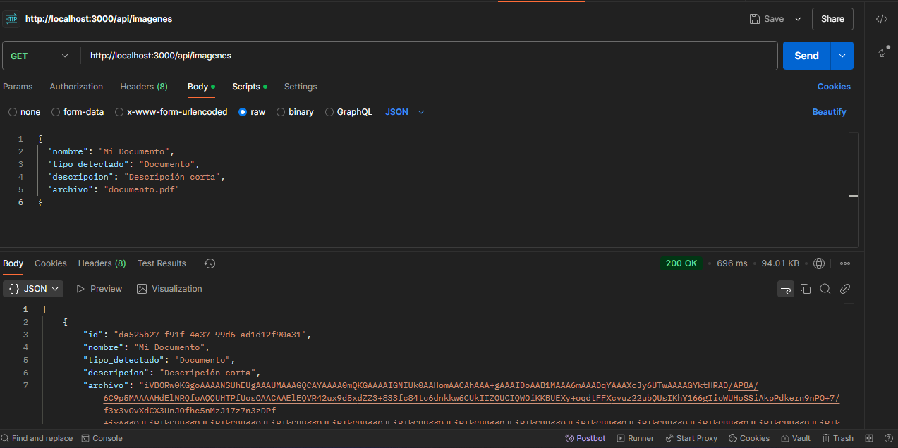

Proyecto de Clasificación de Imágenes

Parte 1: Backend (Node.js)
Instalación Local

En la carpeta evaluacionfinal/, ejecutar:
npm install
npm start

Verifica que la consola muestre Servidor corriendo en puerto 3000 (o el que hayas configurado).

Despliegue en AWS - Lightsail
1. Crear instancia en Lightsail (Amazon Linux o Ubuntu).

2. Conectarte por SSH a la instancia.

3. Instalar Node.js, clonar tu repositorio o subir los archivos.

4. npm install y npm start para arrancar la app.

5. Configurar firewall (puerto 3000, o redireccionar puerto 80).

6. Opcionalmente, usar pm2 para mantener la app en ejecución:
npm install -g pm2
pm2 start src/index.js
pm2 save
pm2 startup

----------------------------------------------------------------------------------------------------

Parte 2: Función Lambda

Lógica de Clasificación
En lambda-clasificacion/index.js, se incluye algo como:

// Ejemplo de clasificación muy básica
function classifyImage(imageData) {
  let typeDetected = 'Foto';
  let description = 'Imagen de una foto';

  if (imageData.includes('document')) {
    typeDetected = 'Documento';
    description = 'Imagen de un documento';
  } else if (imageData.includes('invoice')) {
    typeDetected = 'Factura';
    description = 'Imagen de una factura';
  }
  return { typeDetected, description };
}

Invocación de la API del Backend
Tras la clasificación, se hace una petición POST a /api/imagenes:

await axios.post(process.env.BACKEND_API_URL, {
  nombre: fileName,
  tipo_detectado: typeDetected,
  descripcion: description,
  archivo: base64Image
});

La Lambda retorna un JSON con statusCode, body (ejemplo):

return {
  statusCode: 200,
  body: JSON.stringify({
    message: 'Clasificación exitosa',
    classification: { typeDetected, description },
    insertedImage: response.data
  })
};

Despliegue de la Lambda
1. Crea la función en la consola de AWS Lambda (Node.js).
2. Configura la variable de entorno BACKEND_API_URL en la consola de Lambda.
3. Crea un API Gateway que dispare la Lambda en un endpoint público.

----------------------------------------------------------------------------------------------------

Parte 3: Integración

La meta es tener una interfaz HTML (con o sin Bootstrap) para:
* Subir una imagen
* Ver el tipo de imagen detectado.
* Guardar automáticamente los datos en la base de datos.
* Listar todas las imágenes guardadas y mostrarlas en tabla (incluyendo la imagen decodificada).

HTML/Bootstrap
Un ejemplo de interfaz se encuentra en evaluacionfinal/index.html.
* Muestra un formulario para subir una imagen.
* Convierte la imagen a Base64 y la envía a la URL de API Gateway.
* Muestra el resultado (tipo detectado, descripción).
* Luego llama al backend para obtener la lista completa de imágenes y las renderiza.

<form id="uploadForm">
  <input type="file" accept="image/*" />
  <button type="submit">Subir</button>
</form>

En el <script>:

// Ejemplo de cómo subir y luego refrescar el listado
form.addEventListener('submit', async (e) => {
  // 1. Convertir a Base64
  // 2. fetch(...) a la API Gateway -> Lambda
  // 3. Recibir la respuesta y mostrar el resultado
  // 4. Llamar a loadImages() para refrescar la tabla
});

async function loadImages() {
  // GET a http://<mi-backend>/api/imagenes
  // Construir tabla con los datos
}

Visualizar Resultados
Para mostrar la imagen Base64 en HTML, se usa un .

Para mostrar datos como id, nombre, tipo_detectado, descripcion, se construye una tabla dinámica.

